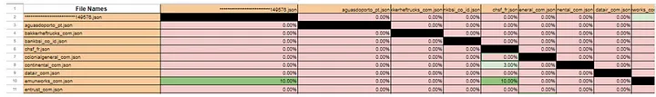
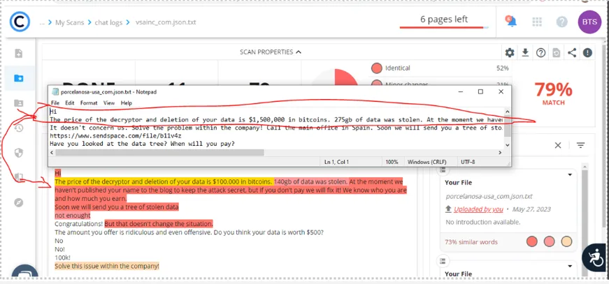

没有怎么参与过勒索软件的调查，这是一个全新的领域，当小故事一样看看。欢迎讨论～

# 大致翻译和解析
**标题：通过文本相似度检测和聊天记录来追踪勒索软件攻击者
Tracing+Ransomware Threat Actors Through Stylometric Analysis and Chat Log Examination**

[Unmasking Ransomware Using Stylometric Analysis: Shadow, 8BASE, Rancoz](https://blog.bushidotoken.net/2023/05/unmasking-ransomware-using-stylometric.html)
提到使用文本相似度检测（stylometry）来识别流行病毒变种，由此作者想到了一个[仓库](https://github.com/Casualtek/Ransomchats)，里面分享了一些和勒索病毒组织交涉的聊天记录

假设同一个组织下有比较类似的说话方式，通过文体分析（stylometric analysis）分析常用的词语、用词习惯、标点

作者想要将同一个组织相关的交涉聊天记录进行相似度比较，于是将每个聊天记录的攻击者消息提取出来变成文本 （本来是json），并
- 使用抄袭监测工具Copyleaks来检测相似度
- 直接比较几个文档的内容
- 根据相似度分离出团队内不同的人，并用apply magic sauce来对他们建立心理学画像

相似度结果部分截图：

文本比较结果：
  

文本比较结果比较直观，看到同一个勒索软件会有相似的opening。
作者还分享了几个画像结果，准确性忽略不计，但是蛮有趣的
> 熟练工1号 From LockBit
> 40岁，男，自由与艺术派，不爱社交，喜欢独立工作，容易有压力和感到忧郁，40%可能行是leader，INTP人（检测结果还挺新潮）
文中是以漂亮图表的形式展现出来的。有兴趣可以看看原文截图。这个工具蛮有意思的。

# 深入思考
- What is Stylometric Analysis? 
文本分析

- What is Ransomeware Negotiation?
感染勒索病毒后，受害者与攻击者进行相关交易的对话。经常性出现砍价，撒泼打滚要打折，还有攻击者勒索30w只乐意给1千5的。偶尔会跟攻击者讨教本公司的安全问题，还蛮有趣的。

- How Stylometric Analysis and Ransomeware Negotiation performance in the study?
同一个组织应该会有相同的目标以及常用话术，通过勒索交易会话来分辨是不是同一个团伙

- Do you think this can help with your work?
感觉没有太多帮助，作者的数据并不是很有说服力，但是思路很有趣。摸鱼快乐upup

原文地址：https://medium.com/@callyso0414/tracing-ransomware-threat-actors-through-stylometric-analysis-and-chat-log-examination-23f0f84abba8